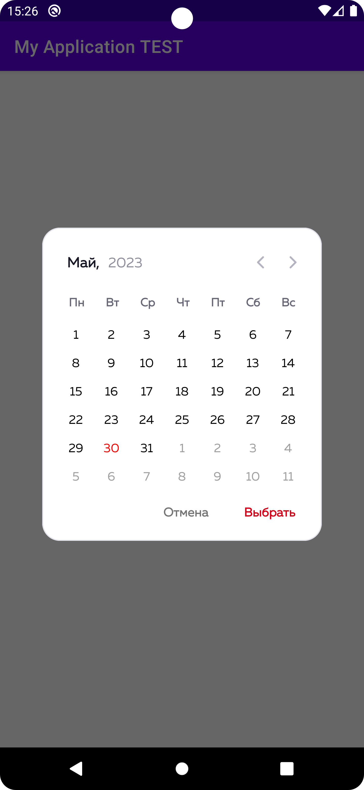
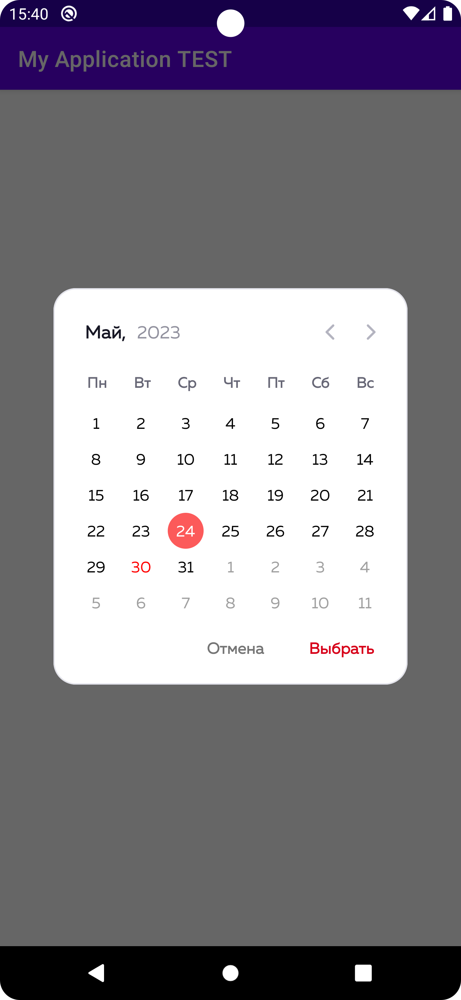

# CustomCalendar

CustomCalendar Library

> Step 1. Add the JitPack repository to your build file

```gradle
allprojects {
	repositories {
		...
		maven { url 'https://jitpack.io' }
	}
}
```

> Step 2. Add the dependency

  ```gradle
dependencies {
  	implementation 'com.github.Imfarrik:CustomCalendar:1.0.0'
}
```

 

Features
========

``` kotlin
    private fun showNewDialog() {
        val dialog = Dialog(this)
        dialog.apply {
            setContentView(R.layout.custom_dialog_calendar)
            window?.setBackgroundDrawable(ColorDrawable(Color.TRANSPARENT))
        }
        val btnX = dialog.findViewById<TextView>(R.id.textView20)
        val btnDone = dialog.findViewById<TextView>(R.id.textView21)
        val calendar = dialog.findViewById<CustomDatePickerYear>(R.id.calendar)

        btnX.setOnClickListener {
            dialog.cancel()
        }

        btnDone.setOnClickListener {
            Toast.makeText(this, calendar.fullDate, Toast.LENGTH_SHORT).show()
        }

        dialog.show()

    }
}
```